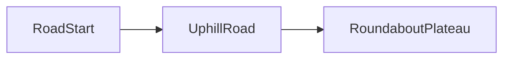

# Level 3 — Rakennusopas (vaiheittain)

> Tämä dokumentti on kirjoitettu sekä sinulle että tekoälyavustajalle kontekstiksi.
> Se kuvaa Level 3:n visuaalisen idean ja antaa **numeroidut vaiheet**, jotka voit tehdä yksi kerrallaan Godot-editorissa.

**Konsepti:** ylämäki **autotie** pääreittinä, **metsä** taustalla ja tien sivuilla, tien päässä **iso liikenneympyrän tasanne** (litteä alusta, pelattava alue).

Tarkempi projektin tekninen tausta: [ARCHITECTURE.md](ARCHITECTURE.md). Level 2:n rakennusmalli ja koodivihjeet: [LEVEL2_GUIDE.md](LEVEL2_GUIDE.md).

---

## Nykytila repossa

| Kohde | Huomio |
|-------|--------|
| [scenes/levels/level_3.tscn](../scenes/levels/level_3.tscn) | **Stub:** juuren node-nimi voi olla vanhentunut (`Level_2`). Korjaa juuren nimi esim. `Level 3` ja rakenna kenttä tämän alle. |
| [scripts/levels/ForestScatter.cs](../scripts/levels/ForestScatter.cs) | Valmis metsän generointiin; tue `UseRampRoadSurfaceY` ja apron-blendaus kun tie on kalteva rampi. |
| [scripts/levels/LevelExit.cs](../scripts/levels/LevelExit.cs) | `Area3D` + `NextScene`-export → seuraava kenttä tai placeholder. |

---

## Visuaalinen brief (mittasuhteet)

1. **Tie:** selkeä pääakseli (esim. maailman **+X** tai **+Z**). Tie **nousee** kohti ympyrää — pelaajan liike tuntuu ylämäkeen, ei vain tasoa pitkin.
2. **Metsä:** puut **tiheämmin** tien ulkopuolella ja kauempana kameran "taustasuuntaan", harvemmin itse ajoradalla. Kamera on 2.5D-sivulta: metsä lukeutuu syvyyskerrokseksi, ei pelkkä lattiatekstuuri.
3. **Liikenneympyrä:** tien päässä **iso, suhteellisen litteä** kiekko (tai monikulmainen approksimaatio). Keskusta / kaistat voivat olla pelkästään visuaalisia; törmäys riittää yhtenäisenä `StaticBody3D`-pintana.

---

## Layout (looginen virtaus)



Pelaajan polku: aloitus lähellä `RoadStart` → liikkuminen `UphillRoad` pitkin → tapahtumat / exit `RoundaboutPlateau`-alueella.

---

## Vaihe 1 — Scene-runko (pakolliset nodet)

**Tavoite:** tyhjä mutta pelattava kenttä (liiku, kamera, HUD).

- Avaa tai täydennä [level_3.tscn](../scenes/levels/level_3.tscn): juuri **`Node3D`** (nimi esim. `Level 3`).
- Lisää lapset (sama periaate kuin [LEVEL2_GUIDE.md](LEVEL2_GUIDE.md) kohdassa "Lisää pakolliset nodet"):

```
Level 3 (Node3D)
├── Player          ← instance: scenes/characters/player.tscn
├── Camera3D        ← script: scripts/CameraFollow.cs
├── HUD             ← instance: scenes/ui/hud.tscn
├── World           ← tyhjä Node3D: maasto, tie, metsä, ympyrä (vaiheista 2–4)
└── [Lighting / WorldEnvironment]  ← voi siirtää vaiheeseen 6
```

- **CameraFollow:** aseta `TargetPath` → `Player`-node.
- **PlayerController** (Inspector): säädä `DepthMovementEnabled`, `DepthClampMin` / `DepthClampMax` tien leveyden ja ympyrän halkaisijan mukaan kun maailma on paikallaan.

**Checklist:** kenttä käynnistyy F5:llä; pelaaja ei putoa (väliaikainen lattia ok); kamera seuraa.

---

## Vaihe 2 — Tie ylämäkeen

**Tavoite:** yksi johdonmukainen **käveltävä** pinta kaltevuudella kohti ympyrää.

Käytännölliset toteutukset (valitse yksi tai yhdistä):

| Tapa | Kuvaus |
|------|--------|
| Segmentit | Useita `StaticBody3D` + `BoxShape3D` / mesh — jokainen hieman kallistettu; päät limittäin ilman rakoa. |
| CSG | `CSGCombiner3D` / `CSGBox3D` rampiksi; lopuksi voi bakeloida meshiksi jos haluat kevyemmän puun. |
| Ulkoinen mesh | Blender tms. yksi `MeshInstance3D` + yksi `StaticBody3D` + `ConcavePolygonShape3D` tai yksinkertaistettu `ConvexPolygonShape3D` / useat boxit. |

**Törmäys:** pelaaja (kerros 1) osuu tien pintaan; lisää matalat **reunat** tai invisible wallit, ettei pelaaja liu'u tien ulkopuolelle.

**Checklist:** pystyt kävelemään alusta loppuun hyppimättä; kaltevuus ei jää "liian jyrkksi" hahmon `move_and_slide`-asetuksille.

---

## Vaihe 3 — Metsä (tausta ja reunat)

**Tavoite:** tiheä puusto tien ulkopuolella, ei puiden läpä-ajoa keskellä tietä.

- Lisää `World`-alle node **`ForestScatter`** ([ForestScatter.cs](../scripts/levels/ForestScatter.cs)).
- Täytä **PackedScene**-slotit (`CommonTree1` …) olemassa olevilla puumalleilla (esim. `assets/models/nature/` -polun scenet, sama tyyli kuin level 2).
- Säädä **`XMinMax` / `ZMinMax`** niin, että scatter peittää tien **sivut** ja **taustan**, ei tien keskilinjaa.
- Käytä **`ExcludeRectEnabled`** + `ExcludeRectMinXZ` / `ExcludeRectMaxXZ` estämään generointi tien ja liikenneympyrän päältä.
- Jos puut seuraavat mäen kaltevuutta: ota **`UseRampRoadSurfaceY`** päälle ja kopioi rampin **origo** ja **akselit** tien pää `StaticBody3D` / `MeshInstance3D` -transformista (tarkat arvot lukitset editorissa kokeilemalla). Hyödynnä tarvittaessa `ClampRampAlongMaxLx` ja apron-kenttiä, jos tie yhdistyy tasaisempaan aproniin ennen ympyrää — logiikka on sama kuin level 2:n kommenteissa.

**Checklist:** puut eivät törrötä keskellä tietä; Pi-testissä `TotalTrees` pysyy kohtuullisena (ks. vaihe 6).

---

## Vaihe 4 — Liikenneympyrän tasanne

**Tavoite:** tien päässä iso **litteä** alusta; törmäys yhtenäinen tien kanssa.

- Rakenna ympyrä esim. **ohut sylinteri** (`CylinderMesh` + `StaticBody3D` + `CylinderShape3D`) tai **monikulmainen extrudoitu** mesh.
- Kohdista ympyrän **pinta** niin, että tien **yläpinta** kohtaa ympyrän reunan samalla korkeudella (ei askelta törmäyksessä).
- Visuaalit: keskisaareke (`MeshInstance3D`), valinnainen "kaista" materiaalilla tai erillisillä ohuisilla mesheillä.
- Jos tarvitset **NPC/ajoneuvo**-propsin myöhemmin, jätä `Node3D`-ankkurit merkityille paikoille (ei pakollinen tässä vaiheessa).

**Checklist:** pelaaja kävelee tieltä ympyrälle ilman törmäys-reikää; ympyrän halkaisija vastaa suunniteltua "isoa" tasannetta.

---

## Vaihe 5 — Pelilogiikka (minimi)

**Tavoite:** selkeä aloitus ja poistuminen kentästä.

- **Spawn:** aseta `Player` alkuun `RoadStart` tai merkitse tyhjä `Marker3D` `PlayerSpawn` ja käytä myöhemmin skriptillä (jos lisäät `Level3Director.cs` tms.).
- **Checkpoint** (valinnainen): kopioi/pitä [Checkpoint.cs](../scripts/levels/Checkpoint.cs) -malli jos projektissa käytössä level 1–2:ssa.
- **Exit:** lisää `Area3D` + [LevelExit.cs](../scripts/levels/LevelExit.cs). Aseta Inspectorissa `NextScene` (esim. tuleva `level_4.tscn` tai toistaiseksi `main_menu` / testiscene).
- **GameState:** jos level 3 vaatii joystickia tai dronea, tarkista `GameState.Instance` ja [GameState.cs](../scripts/GameState.cs) / `project.godot` autoload — käytä vain jos mekaniikka sitä vaatii.

**Checklist:** exit vaihtaa sceneä kerran (ei tuplatriggerointia ilman uudelleenkäynnistystä).

---

## Vaihe 6 — Polish ja Raspberry Pi 5

- **WorldEnvironment:** sumu (`fog`) tai depth-haze auttaa metsän taustaa ja piilottaa LOD-reunan.
- **Valaistus:** yksi selkeä aurinko + maltillinen varjo (Pi: vältä raskaat reaaliaikaiset varjot suurilla alueilla).
- **Ääni:** taustamus iikka `AudioStreamPlayer3D` tai 2D player juuressa; loop tasolle sopiva.
- **Suorituskyky (Pi 5):**
  - Älä kasvata `ForestScatter.TotalTrees` liian suureksi; mieluummin harvempi metsä + sumu.
  - Vältä tuhansia erillisiä raskaita FBX-propseja ilman instanssointia / MultiMesh-harkintaa.
  - Testaa **ARM64**-build oikealla laitteella ennen julkaisua.

---

## Viholliset ja boss (valinnainen jatko)

Kun maailma on kasassa, voit lisätä `EnemySpawner` / aalto-directorin / bossin samaan tapaan kuin [LEVEL2_GUIDE.md](LEVEL2_GUIDE.md) kuvaa. Pidä törmäyskerrokset samoin kuin aiemmissa tasoissa (pelaaja 1, vihollinen 2).

---

## Viitteet (pikalinkit)

| Tiedosto | Miksi |
|----------|--------|
| [ARCHITECTURE.md](ARCHITECTURE.md) | Pelaaja, kamera, tasojen roolit |
| [LEVEL2_GUIDE.md](LEVEL2_GUIDE.md) | Player/Camera/HUD-lista, koodivihjeet, Pi-muistutus |
| [ForestScatter.cs](../scripts/levels/ForestScatter.cs) | Metsän generointi ja tien pinta-Y |
| [LevelExit.cs](../scripts/levels/LevelExit.cs) | Kentän läpäisy → seuraava scene |
| [level_3.tscn](../scenes/levels/level_3.tscn) | Kentän scene-tiedosto |

---

## Changelog

- **2026-04-21:** Ensimmäinen versio Level 3 -kehitysoppaasta (tie + metsä + liikenneympyrä, vaiheet 1–6).
